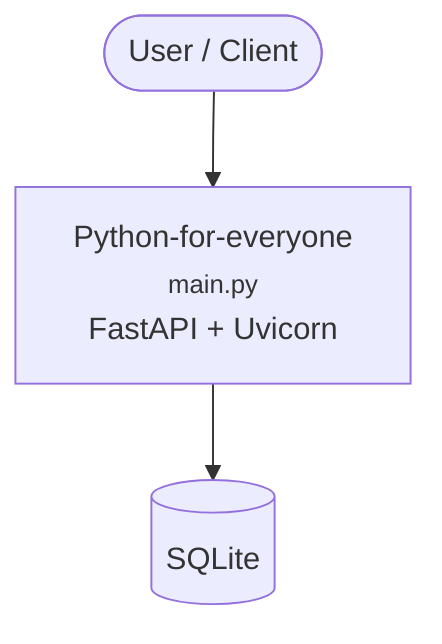

# Python for Everyone

A comprehensive Python learning repository designed for beginners and intermediate learners. This project covers fundamental to advanced Python concepts through practical examples, exercises, and real-world applications.

## 📚 Project Overview

This repository is organized into progressive learning modules, each focusing on specific Python concepts and practical applications. From basic variables and data types to advanced financial analysis, this project provides hands-on experience with Python programming.

## 🗂️ Repository Structure

```
Python-for-everyone/
├── Class-1/           # Basic Python fundamentals
├── Class-2/           # Functions and modules
├── Class-3/           # Object-oriented programming
├── Class-4/           # Data science with NumPy and Pandas
├── Class-5/           # Exception handling and file operations
├── Class-6/           # Data visualization and plotting
├── Financial-Analytics/ # Advanced financial analysis
├── README.md          # This file
└── requirements.txt   # Project dependencies
```

## 📖 Learning Modules

### Class 1: Python Fundamentals
**Location:** `Class-1/`
- **Variables and Data Types** (`variables.py`): Demonstrates Python's dynamic typing, numeric types, strings, and complex numbers
- **Conditional Statements** (`condition-if.py`): Basic if-else logic and control flow
- **Loops** (`for-loop.py`): Iteration with for and while loops
- **Sequences** (`Sequences.py`): Lists, tuples, and sequence operations
- **String Operations** (`strings.py`): String manipulation and formatting
- **User Input** (`user-input.py`): Interactive programs with user input
- **Assignment Operators** (`Assignment-operator.py`): Various assignment and arithmetic operators

### Class 2: Functions and Modules
**Location:** `Class-2/`
- **Function Basics** (`functions.py`): Function definition, parameters, return values, and recursion
- **Scope and Namespaces** (`scope.py`, `global-scope.py`): Variable scope and global/local variables
- **String Functions** (`String-functions.py`): Built-in string methods and operations
- **Modules** (`modules.py`): Creating and importing Python modules
- **Named Tuples** (`named-tuple.py`): Advanced data structures
- **Loop Functions** (`loop-functions.py`): Functional programming with loops

### Class 3: Object-Oriented Programming
**Location:** `Class-3/`
- **Classes and Objects** (`Classes.py`): Basic OOP concepts, inheritance, and polymorphism
- **Operator Overloading** (`usingOperatorOverload.py`, `Vector.py`): Custom operators for classes
- **Class Override** (`ClassOverride.py`): Method overriding and inheritance
- **Sorting Algorithms** (`bubble-sort.py`): Implementation of sorting algorithms
- **Web Development** (`build-webpage.py`): Basic web page generation
- **Network Programming** (`my_socket_server.py`): Socket programming basics

### Class 4: Data Science Foundations
**Location:** `Class-4/`
- **NumPy Arrays** (`numpy-array-setting.py`, `numpy-details.py`): Numerical computing with NumPy
- **NumPy Functions** (`numpy-functions.py`, `numpy-universal-functions.py`): Advanced NumPy operations
- **Pandas DataFrames** (`pandas-dataframe-load.py`, `pandas-dataframe.py`): Data manipulation with Pandas
- **Data Slicing** (`slicing-array.py`): Array and DataFrame slicing techniques
- **Web APIs** (`complex-fastapi.py`, `fastcgi.py`): Building web APIs with FastAPI
- **Database Operations** (`sqlite.ipynb`): SQLite database integration
- **Jupyter Notebooks** (`Intro.ipynb`, `Lorenz.ipynb`): Interactive data analysis

### Class 5: Advanced Python Concepts
**Location:** `Class-5/`
- **Exception Handling** (`exception-handle.py`, `try-except.py`): Error handling and debugging
- **File Operations** (`file-operation.py`): Reading and writing files
- **Bank Account System** (`bankaccount.py`): Practical OOP application
- **Mathematical Operations** (`fraction.py`, `cube.py`): Custom mathematical classes
- **Data Analysis** (`numpy-second-section.py`, `pandas-dataframe.py`): Advanced data processing
- **Visualization** (`plots.py`): Basic plotting with matplotlib
- **Homework Solutions** (`homework.py`, `hw2.py`): Practice exercises

### Class 6: Data Visualization and Financial Analysis
**Location:** `Class-6/`
- **Financial Functions** (`financial_functions.py`): Financial calculations and metrics
- **Portfolio Analysis** (`funds.py`, `keg.py`): Investment portfolio management
- **Data Visualization** (`plot.py`, `plot-style.py`): Advanced plotting techniques
- **Matplotlib Integration** (`import matplotlib.py`): Comprehensive plotting examples
- **Excel Integration** (`apple.xlsx`, `myportfolio.xlsx`): Working with Excel files

### Financial Analytics: Advanced Applications
**Location:** `Financial-Analytics/`
- **Data Acquisition** (`scripts/1_financial_data.py`): Downloading financial data with yfinance
- **Image Processing** (`scripts/convertImagetoCode.py`): Converting images to code
- **Subprocess Management** (`scripts/import subprocess.py`): System integration
- **Data Storage** (`data/`): Financial datasets and portfolio data

## 🚀 Getting Started

### Prerequisites
- Python 3.7 or higher
- pip (Python package installer)
- Git (for cloning the repository)

### Installation

1. **Clone the Repository:**
   ```bash
   git clone https://github.com/avnit/Python-for-everyone.git
   cd Python-for-everyone
   ```

2. **Create a Virtual Environment (Recommended):**
   ```bash
   python -m venv venv
   
   # On Windows:
   venv\Scripts\activate
   
   # On macOS/Linux:
   source venv/bin/activate
   ```

3. **Install Dependencies:**
   ```bash
   pip install -r requirements.txt
   ```

### Running the Examples

Each class folder contains standalone Python files that can be run independently:

```bash
# Run a specific example
python Class-1/variables.py
python Class-2/functions.py
python Class-3/Classes.py

# For Jupyter notebooks
jupyter notebook Class-4/Intro.ipynb
```

## 📦 Key Dependencies

The project uses several popular Python libraries:

- **Core Python**: Built-in libraries and standard modules
- **Data Science**: NumPy, Pandas, Matplotlib
- **Financial Analysis**: yfinance, pandas-datareader
- **Web Development**: FastAPI, Flask
- **Database**: SQLite3
- **Jupyter**: Jupyter Notebook for interactive development

## 🎯 Learning Objectives

By completing this project, you will:

1. **Master Python Fundamentals**: Variables, data types, control structures, and functions
2. **Understand OOP**: Classes, inheritance, polymorphism, and encapsulation
3. **Learn Data Science**: NumPy arrays, Pandas DataFrames, and data manipulation
4. **Practice Exception Handling**: Robust error handling and debugging
5. **Explore File Operations**: Reading, writing, and processing different file formats
6. **Create Visualizations**: Charts, graphs, and data presentation
7. **Build Real Applications**: Financial analysis, web APIs, and data processing

## 📝 Code Quality Standards

All code in this repository follows Python best practices:

- **PEP 8 Style Guide**: Consistent code formatting and naming conventions
- **Docstrings**: Comprehensive documentation for all functions and classes
- **Type Hints**: Optional type annotations for better code clarity
- **Error Handling**: Proper exception handling and validation
- **Modular Design**: Reusable functions and well-organized code structure

## 🤝 Contributing

We welcome contributions! Here's how you can help:

1. **Fork the repository**
2. **Create a feature branch**: `git checkout -b feature/amazing-feature`
3. **Make your changes**: Follow the existing code style and add documentation
4. **Test your code**: Ensure all examples run correctly
5. Add user name and email to git `git config --global user.name "Your Name"
git config --global user.email "your_email@example.com"`
6. **Commit your changes**: `git commit -m 'Add amazing feature'`
7. **Push to the branch**: `git push origin feature/amazing-feature`
8. **Open a Pull Request**: Describe your changes and improvements

### Contribution Guidelines

- Follow PEP 8 style guidelines
- Add docstrings to all new functions and classes
- Include example usage in comments
- Update documentation for any new features
- Test your code before submitting

## 📄 License

This project is licensed under the MIT License - see the [LICENSE](LICENSE) file for details.

## 👨‍💻 Author

**Avnit** - *Initial work* - [GitHub Profile](https://github.com/avnit)

## 🙏 Acknowledgments

- Python Software Foundation for the amazing programming language
- The open-source community for the excellent libraries used in this project
- All contributors who have helped improve this learning resource

## 📞 Support

If you have questions or need help:

1. Check the documentation in each class folder
2. Review the code comments and docstrings
3. Open an issue on GitHub for bugs or feature requests
4. Create a discussion for general questions

---

**Happy Learning! 🐍✨**

<!-- ARCH-DIAGRAM:START -->

## Architecture

> Auto-generated architecture diagram. See [`docs/context-map.md`](docs/context-map.md) for the full context map (core application, containers/cloud, and database connections).



<!-- ARCH-DIAGRAM:END -->
