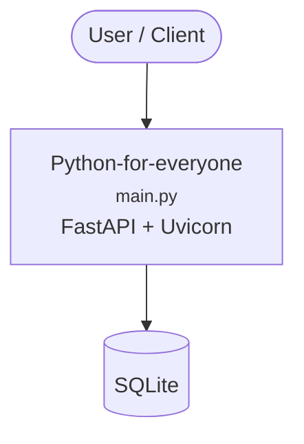

# Context Map — `Python-for-everyone`

> Auto-generated architecture & deployment context map. Summarizes the core application, container/cloud footprint, and database connections. Regenerate after significant structural changes.

**Repo:** `avnit/Python-for-everyone` · **Original** · Public · Primary language: Jupyter Notebook · Default branch: `main` · Files: 126

**Description:** This is for the class

## 1. Core application

Python for Everyone

- **Frameworks / runtime:** FastAPI + Uvicorn, Jupyter notebooks
- **Entry points:** `Final-Project/main.py`
- **Listens on port(s):** 22

## 2. Containers & cloud applications

**Detected cloud platforms / services:** Terraform

## 3. Database connections

**Datastores in use:** SQLite

## 4. Architecture diagram

## 5. Security posture

- **Static scan findings:** 2 high

| Severity | Rule | File:Line |
|---|---|---|
| high | generic-secret-assign | `Class-2/String-functions.py:285` |
| high | py-flask-debug | `Class-3/build-webpage.py:13` |

---
_Generated by repo context-mapping pass on 2026-08-13._